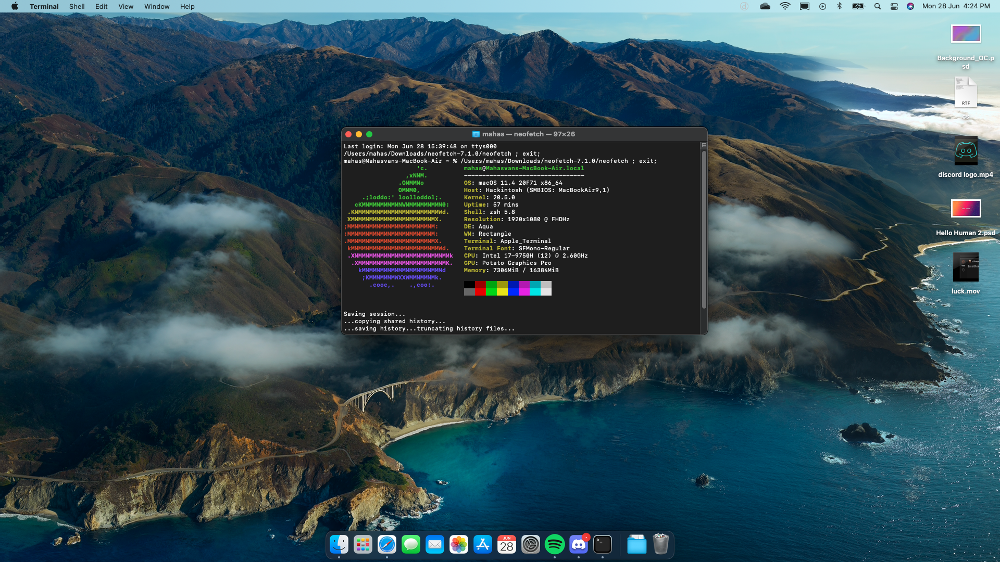
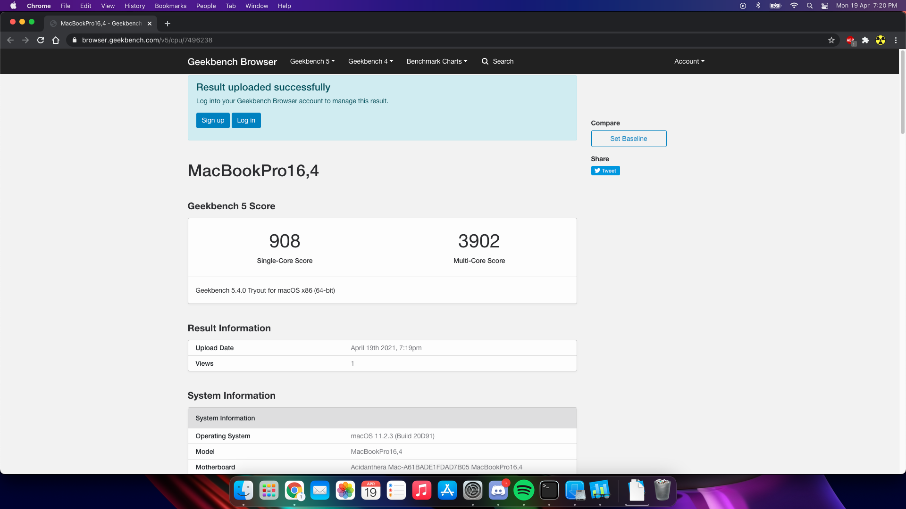
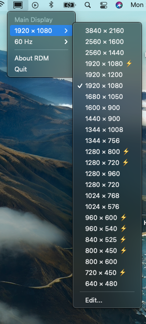

# Inspiron-759x-Hackintosh
This repository is for people who want macOS on their Inspiron 759x laptops.

## Current OpenCore version on this EFI: 0.7.9 (Compiled from source)

### Specs:
| Part          | Name      |
|---------------|-----------|
| CPU | Intel Core i7 9750H |
| RAM | 16GB DDR4 2666Mhz   |
| Graphics | GTX 1050 (disabled via SSDT) + UHD630 |
| Connectivity |Intel AC9560 Wifi+BT |

## Note: The files in the source code are ONLY FOR REFERENCE
Modify the required fields in the `config.plist` before using this in your machine. (Or better, just don't use my EFI. Simple)

Follow Dortania's [Opencore Install Guide](https://dortania.github.io/OpenCore-Install-Guide/) to make your EFI. (Highly recomended)

With that said, here's my EFI folder anyway.

### Kexts

The kexts mentioned in the dortania guide are all that are needed to boot. However, there are some kexts that offer extra features. These are recommended for post-install.

#### Note: You may need CpuTscSync if your booting process gets stuck. (I need it, so I included it in the kexts folder)

CPUFriend: Facilitates proper Power management for the CPU. Needs another kext `CPUFriendDataProvider`, which we can make ourselves by following the post install guide. I have included this kext which was made for my machine, according to my requirements.

NoTouchID.kext: Fingerprint sensors in Hackintoshes have no way of working in macOS. So we use this kext.

BrightnessKeys.kext: Facilitates automatic handling of brightness keys without acpi modification.

VirtualSMC Plugins:
 - SMCProcessor
 - SMCSuperIO
 - SMCDellSensors
 - SMCBatteryManager

VoodooI2C + VoodooI2cHID: Needed for proper trackpad functioning. 

Sinetek-rtsx.kext: Used for enabling the SD card reader. Note that this may or may not not work on your machine.

### Benchmarks

### Troubleshooting

Even though you followed the Dortania guide correctly, there are bound to be errors. There's the Hackintosh community, where you can discuss and solve problems.
r/Hackintosh discord server: https://discord.gg/u8V7N5C
r/Hackintosh Subreddit: https://www.reddit.com/r/hackintosh/

### Bonus

#### Renaming the Integrated Graphics in macOS
You can rename your integrated graphics card by making an entry called `model` inside `PciRoot(0x0)/Pci(0x2,0x0)` in your config.plist

#### Getting a smoother UI by faking a 1080p display as 1080p HiDPI

Download [RDM](https://github.com/usr-sse2/RDM) and follow the instructions below

Click on `Edit` in the bottom of the resolution selector pane

Enter your resolution, and check the boxes for `Retina` and `HiDPI`

Choose the preview icon you want, I chose a MacBook Air's image. After rebooting, your 1080p HiDPI resolution should be visible in the RDM resolution pane.

Add RDM to your login items, and enjoy!
